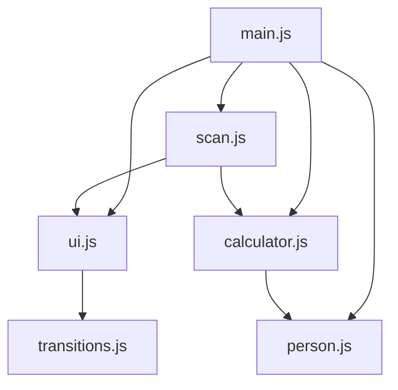

# Module Structure Documentation

## Core Modules

### 1. Calculator Module (`js/calculator.js`)
```typescript
interface CalculatorModule {
  calculate(): void;
  addItemField(): void;
  removeItem(): void;
  updateTotals(): void;
}
```

### 2. Person Module (`js/person.js`)
```typescript
interface PersonModule {
  addPersonField(): void;
  removePerson(): void;
  addScannedItemToPerson(name: string, item: string, price: number): boolean;
}
```

### 3. Scan Module (`js/scan.js`)
```typescript
interface ScanModule {
  initiateScan(): void;
  captureImage(): Promise<void>;
  processImage(imageData: Blob): Promise<ScanResult>;
  displayResults(results: ScanResult): void;
}
```

### 4. UI Module (`js/ui.js`)
```typescript
interface UIModule {
  init(): void;
  showToast(message: string, type: ToastType): void;
  updateTheme(theme: Theme): void;
  handleNavigation(): void;
}
```

## Module Dependencies



## Event Flow

1. User Interactions
2. Module-specific handlers
3. Cross-module communications
4. UI updates
5. State management

## Implementation Guidelines

- Use ES6 modules with explicit imports/exports
- Implement error boundaries
- Add type checking
- Document public APIs
- Include usage examples